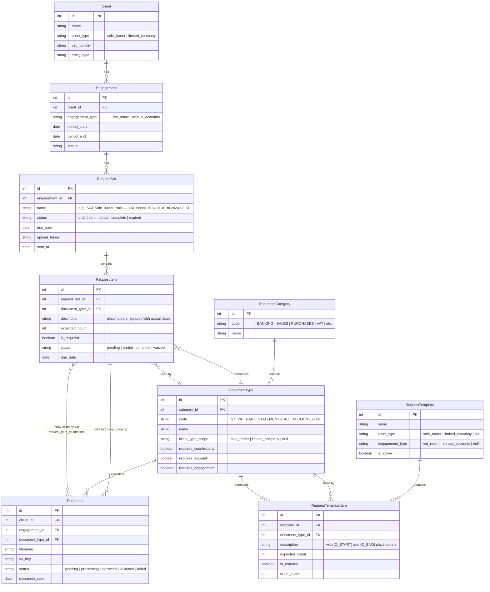
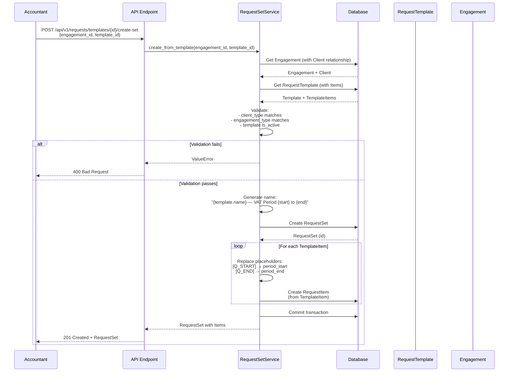
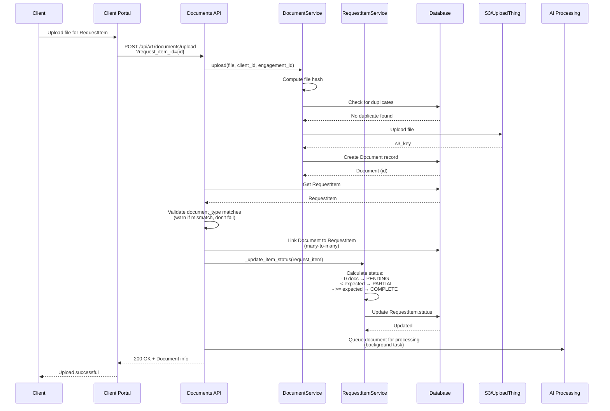
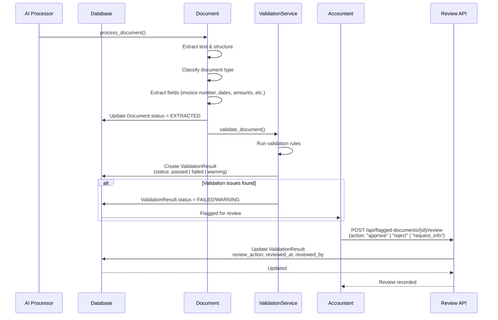
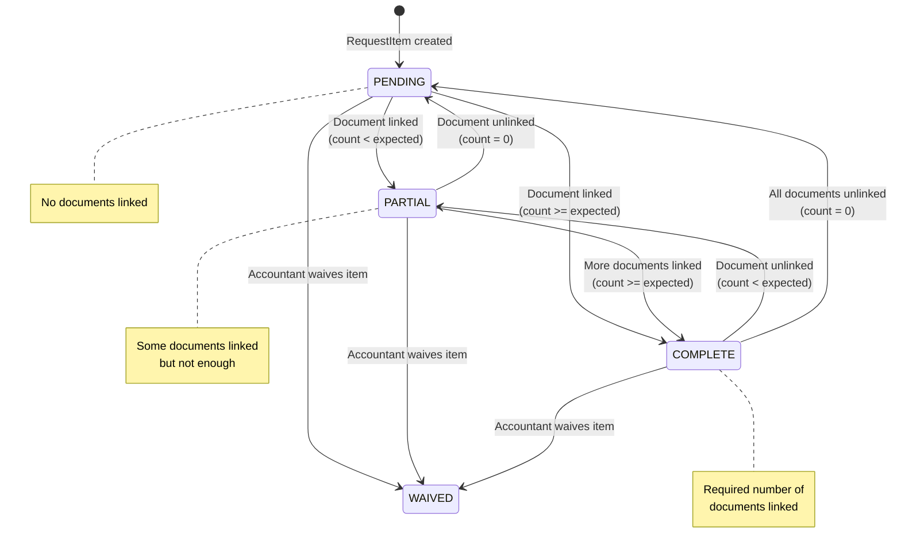

# VAT Sole Trader Pack — Database Schema & Workflow Diagrams

## Database Schema (ER Diagram)



## Workflow: Creating RequestSet from Template



## Workflow: Client Uploads Document



## Workflow: Document Processing & Approval



## Workflow: Request Item Status Flow



## Complete System Flow: End-to-End

```mermaid
flowchart TD
    Start([Accountant creates Engagement]) --> CreateClient{Client exists?}
    CreateClient -->|No| NewClient[Create Client<br/>with client_type='sole_trader']
    NewClient --> CreateEngagement
    CreateClient -->|Yes| CreateEngagement[Create Engagement<br/>engagement_type='vat_return'<br/>period_start, period_end]
    
    CreateEngagement --> GetTemplate[Get RequestTemplate<br/>client_type='sole_trader'<br/>engagement_type='vat_return']
    
    GetTemplate --> CreateRequestSet[Create RequestSet from Template<br/>- Replace [Q_START] and [Q_END]<br/>- Create RequestItems from TemplateItems]
    
    CreateRequestSet --> SendRequest[Send RequestSet to Client<br/>via email/portal]
    
    SendRequest --> ClientUploads[Client uploads documents<br/>via portal]
    
    ClientUploads --> LinkDoc[Link Document to RequestItem<br/>- Validate document_type<br/>- Auto-update RequestItem.status]
    
    LinkDoc --> ProcessDoc[AI processes document<br/>- Classify<br/>- Extract<br/>- Validate]
    
    ProcessDoc --> Review{Validation<br/>issues?}
    
    Review -->|Yes| AccountantReview[Accountant reviews<br/>flagged documents]
    Review -->|No| AutoApproved[Document auto-approved]
    
    AccountantReview --> Approve{Approve?}
    Approve -->|Yes| Approved
    Approve -->|No| Rejected[Document rejected<br/>Client must re-upload]
    Rejected --> ClientUploads
    
    Approved --> CheckComplete{All required<br/>RequestItems<br/>complete?}
    AutoApproved --> CheckComplete
    
    CheckComplete -->|No| ClientUploads
    CheckComplete -->|Yes| BuildPack[Build Pack<br/>- Only approved documents<br/>- Organize by type<br/>- Create ZIP]
    
    BuildPack --> LockPack[Lock RequestSet<br/>status = LOCKED]
    LockPack --> Export[Export Pack<br/>for submission]
    
    Export --> End([Pack ready for HMRC])
    
    style CreateRequestSet fill:#e1f5ff
    style LinkDoc fill:#fff4e1
    style ProcessDoc fill:#ffe1f5
    style BuildPack fill:#e1ffe1
```

## Key Relationships Summary

### Template → RequestSet Creation
- **RequestTemplate** defines the structure (document types, descriptions, order)
- **RequestTemplateItem** has placeholders: `[Q_START]` and `[Q_END]`
- When creating **RequestSet** from template:
  - Placeholders are replaced with actual dates from **Engagement**
  - Each **RequestTemplateItem** becomes a **RequestItem**
  - **RequestItem** links to the same **DocumentType** as the template item

### Document → RequestItem Linking
- **Document** can be linked to multiple **RequestItems** (many-to-many)
- When document is linked:
  - **RequestItem.status** auto-updates based on document count
  - Document type validation (warns if mismatch, doesn't fail)
- When document is unlinked:
  - **RequestItem.status** updates back

### Status Progression
- **RequestItem**: `PENDING` → `PARTIAL` → `COMPLETE` (or `WAIVED`)
- **RequestSet**: `DRAFT` → `SENT` → `PARTIAL` → `COMPLETE` (or `EXPIRED`)
- **Document**: `PENDING` → `PROCESSING` → `EXTRACTED` → `VALIDATED` (or `FAILED`)

### "Choose One" Pattern
For sales evidence, the template creates **3 separate RequestItems**:
- `ST_VAT_SALES_INVOICES` (is_required=False)
- `ST_VAT_SALES_POS_SUMMARY` (is_required=False)
- `ST_VAT_SALES_CASHBOOK` (is_required=False)

Client can upload **any one** of these, and the system will mark the request as satisfied.
